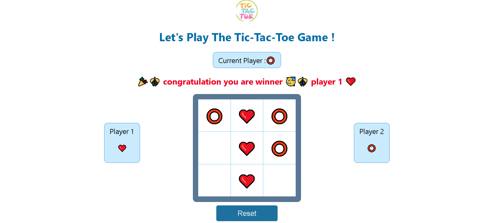

## Tic-tac-toe
Tic Tac Toe is a game you play on a piece of paper. You draw a grid with three rows and three columns. Two players take turns putting their symbol in an empty space. One player uses "X," and the other uses "O." The goal is to get three of your symbols in a row, either horizontally, vertically, or diagonally.

